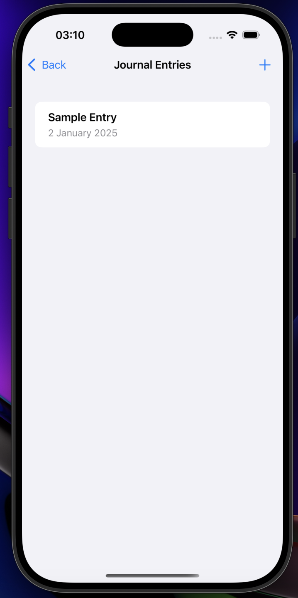
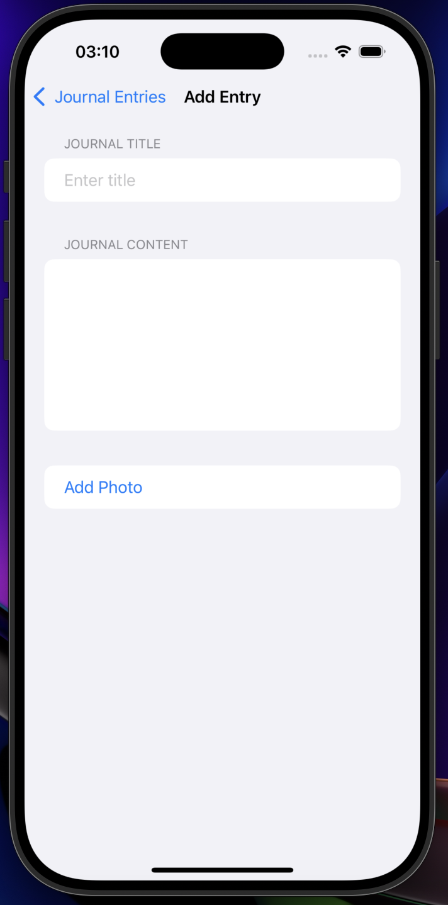
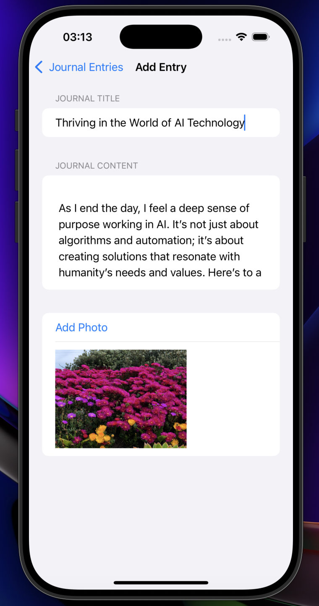

# 📓 Journal App

## ✨ Description
The **Journal App** is an elegant iOS application designed to help users record their thoughts, memories, and daily experiences. Featuring a minimalist design, secure access with FaceID/TouchID, and photo integration, this app is your perfect digital diary.

---

## 🌟 Features
1. **📝 Daily Journal Entries**
   - Add, edit, and delete text-based journal entries.
2. **📅 Organized by Date**
   - Automatically sort and display entries by date.
3. **🔒 Secure Access**
   - Protect your journal with FaceID/TouchID for privacy.
4. **📸 Photo Integration**
   - Attach photos to your journal entries.
5. **🎨 Stunning UI**
   - Enjoy a clean and modern user interface with gradient backgrounds.

---

## 🛠️ Requirements
- **📱 iOS Version**: 15.0+
- **🖥️ Xcode Version**: 14.0+
- **⚙️ Swift Version**: 5.6

---

## 🚀 Installation
1. Clone the repository:
   ```bash
   git clone https://github.com/your-repo/journal-app.git
   ```
2. Open the project in Xcode:
   ```bash
   cd journal-app
   open JournalApp.xcodeproj
   ```
3. Build and run the project on a simulator or device.

---

## 🎮 How to Use
1. **📝 Create a Journal Entry**
   - Tap the "Add Entry" button to write a new journal entry.
2. **📸 Attach Photos**
   - Add a photo to your entry by selecting it from your photo library.
3. **🔒 Secure Your Journal**
   - Enable FaceID/TouchID for added security.
4. **📅 View by Date**
   - Navigate through your entries, organized chronologically.

---

## 📸 Screenshots
1. 
2. 
3. 
4. 

---

## 🗂️ Folder Structure
```
JournalApp/
├── 🍎 Assets.xcassets/      # Image and color assets
├── 🖌️ ContentView.swift     # Main UI file
├── 📖 JournalListView.swift # Journal entries screen
├── 📸 PhotoPicker.swift     # Photo integration logic
├── 🔒 Authentication.swift  # Biometric authentication logic
├── 📄 README.md             # Documentation
```

---

## 💡 Future Improvements
1. **📂 Cloud Sync**
   - Synchronize entries across devices via iCloud.
2. **🖌️ Custom Themes**
   - Add customizable themes for personalized user experience.
3. **📊 Analytics**
   - Provide insights into writing trends and habits.

---

## 🤝 Contributing
1. Fork the repository.
2. Create a feature branch:
   ```bash
   git checkout -b feature-name
   ```
3. Commit your changes:
   ```bash
   git commit -m "Add feature description"
   ```
4. Push to the branch:
   ```bash
   git push origin feature-name
   ```
5. Open a Pull Request.

---

## 📜 License
This project is licensed under the MIT License. See the [Apptora] file for details.

---

**👨‍💻 Developed with ❤️ by [Pubudu Dilshan]**
